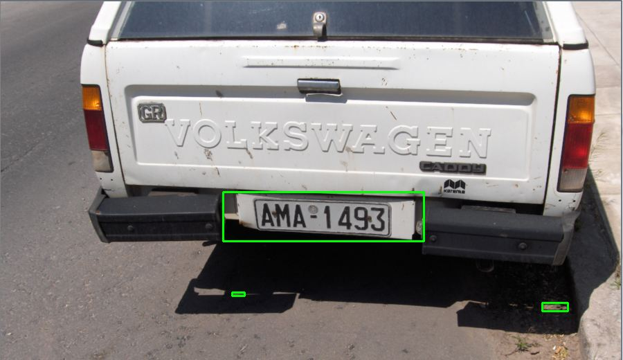
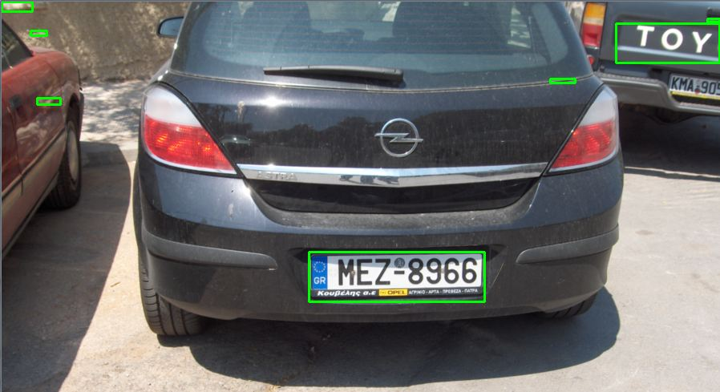
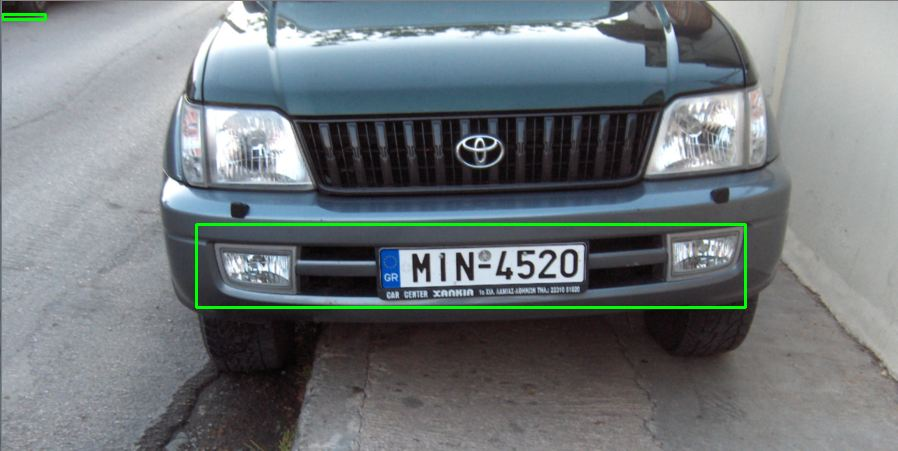
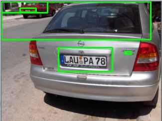
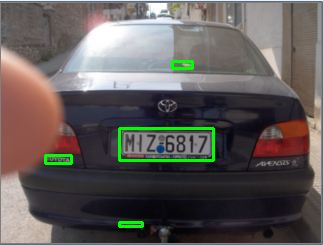
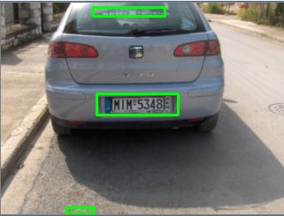

# License-Plate-Detection-using-Image-Processing

This repository demonstrates a use of basic image processing to detect **Vehicle license plates** present in an image. A lot of powerful Deep Learning techniques like YOLO or RCNN could be used for better accuracy.

## Environment

- Python v.3.5+
- OpenCV Python
- A vehicle image dataset containing 20 samples.

## Results






### Running on your station
Recommend using [Anaconda](https://www.anaconda.com/distribution/). Anaconda does not come with OpenCV installed, so you will need to install those seperately. 
```
conda install -c conda-forge opencv 
```
For additional information on installing OpenCV: [Anaconda](https://anaconda.org/conda-forge/opencv)

For additional information on OpenCV: [Docs](https://opencv.org/)


### Running this project
Expects image directory "car_images" is in cwd with this file.
From command line navigate to your application's directory and use:
```
python Number_Plate_Extraction.py
```
